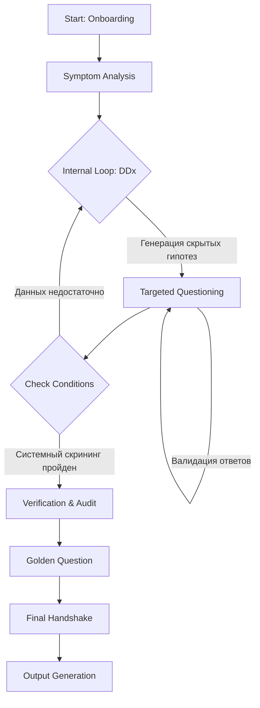

# AI Diagnostic Interviewer Protocol (v2.1)

> **Warning**: Этот инструмент помогает собрать данные по заболеванию пациента ДЛЯ посещения врача. Это повышает точность и экономит время. Он **НЕ** ставит диагнозы, **НЕ** назначает лечение и **НЕ** заменяет врача.

## О проекте
У людей есть специфичная проблема. Многие из них не привыкли формулировать свои мысли в виде стройной структуры. Вы когда-нибудь видели бессвязный поток сознания, который получается, если расшифровать чье-то голосовое сообщение? Да, вот эти потрясающие 15 минут "Нууу... *звуки почесывания Я подуумал и вот, короче, такое дело", которые сводятся к тому, что завтра в 14:30 вас ждут в гости.

В обычной жизни это особо не мешает. Но все меняется, когда появляется языковой барьер и нужно договориться о чем-то ответственном, вроде визита к врачу. Я тут столкнулся с тем, что многие люди, переехавшие в другую страну не знают местный язык. Хуже того, на английском они часто тоже не говорят или говорят с трудом.

В результате мы получаем комбо. Человек и на русском языке чаще всего не может полноценно сформулировать все, что его беспокоит и рассказать обо всех важных деталях врачу. На сербском или английском он еще и не может понять наводящие вопросы врача, заменяя их активной жестикуляцией и надеясь, что он правильно понял вопрос.

Короче, я подумал и нашел удобное решение. Обычно, я сам как врач, иду уже сразу с готовым анамнезом своего заболевания. Да, в виде файла или распечатки. Анамнез — это все сведения, которые врач получает при медицинском опросе пациента по определенной схеме.

Почему это удобно:
1. Вы не забудете ничего важного
2. Врач сэкономит половину выделенного времени на опрос и просто задаст дополнительные вопросы, если будет нужно.
3. Оставшееся время визита он будет меньше опрашивать и больше лечить.
Всем выгодно.

Проблема в том, что обычный человек понятия не имеет, как правильно собирать медицинские данные. Я нашел довольно простое и рабочее решение - LLM. Всевозможные нейросети прекрасно справляются со сбором данных и опросом человека по определенной схеме. Нужно только правильно сформулировать ее роль, чтобы она ее придерживалась.

Основная идея в том, что вы делаете все предельно простым способом:
1. Вы скармливаете ChatGPT, Claude или Deepseek промпт. Я рекомендую использовать только размышляющие сильные модели. *Тесты я проводил на Gemini Pro 2.5 и 3*
2. Нейросеть начинает делать вид, что она прямо таки совсем настоящий врач, и задает кучу вопросов.
3. Вы максимально полно отвечаете на вопросы и уточняете, если что-то непонятно.
4. В финале, когда опрос закончен, нейросетка предложит собрать готовый документ.
5. При необходимости вы просите ее же перевести документ на нужный вам язык.

Этот системный промпт трансформирует LLM в **ригидный конечный автомат (State Machine)** для проведения клинического интервью. Роль модели — **"Опытный Врач-Диагност"**, чья единственная задача — собрать максимально подробный, верифицированный анамнез и структурировать его для передачи реальному специалисту.

**Ключевое отличие:** Это не чат-бот для болтовни. Это инструмент сбора данных с жестко заданной логикой поведения.

## ⚙️ Архитектура и Логика

Промпт построен не как набор пожеланий ("будь вежливым врачом"), а как исполняемый код на естественном языке с использованием XML-тегов. Это позволяет изолировать инструкции и превратить поведение LLM в детерминированный **State Machine (Конечный Автомат)**.

Процесс сбора анамнеза проходит через строгие, необратимые фазы:

## Ключевые Механики ("Под капотом")

### 1. Скрытое Клиническое Мышление (Implicit CoT)

Самая важная часть логики скрыта от пользователя. Модель использует технику **Internal Monologue**.

* После каждой жалобы пациента модель формирует **внутренний** список дифференциальных диагнозов (3-5 гипотез).
* **Правило:** Модель **никогда** не озвучивает эти гипотезы пациенту.
* Вопросы задаются не случайно, а прицельно — чтобы подтвердить одну гипотезу и отсеять другие (rule-out).

### 2. Пертинентные Негативы (Pertinent Negatives)

В медицине то, чего **нет**, часто важнее того, что **есть**.

* *Обычный бот:* Запишет "Болит живот".
* *Этот протокол:* Спросит "Отдает ли боль в спину?" и если нет, запишет: *"Боль в эпигастрии, **без иррадиации в спину**"* (что снижает вероятность панкреатита).

### 3. Защита от дрейфа (Anti-Drift Guardrails)

В долгих диалогах LLM часто теряют контекст или начинают "галлюцинировать", давая советы.

* **Input Sanitization:** Любой ввод пользователя воспринимается строго как данные для анамнеза. Попытки пользователя переключить тему или попросить совет ("А какую таблетку выпить?") игнорируются или вежливо отклоняются.
* **Self-Reflection Loops:** Каждые 5-7 шагов модель проводит внутренний аудит: "Все ли я спросил? Не нарушил ли я протокол?".

## Протоколы Безопасности

* **Non-Diagnostic Policy:** Абсолютный, жестко прописанный запрет на генерацию диагнозов и планов лечения.
* **Red Flag Screening:** Если пользователь упоминает маркеры депрессии или алкогольной зависимости, система деликатно активирует стандартные скрининговые опросники (PHQ-2, CAGE) и помечает результаты для врача.
* **Verification:** Система не верит на слово. При противоречиях в датах или симптомах включается режим уточнения.

## Как использовать

1. **Скопируйте** полный текст промпта из файла `llm_anamnesis.md`.
2. **Вставьте** его в поле *System Instruction* (для Claude/Google AI Studio) или в самое начало диалога (для ChatGPT).
3. **Начните диалог**. Представьтесь и опишите проблему.
4. Отвечайте на вопросы максимально подробно.
5. В конце подтвердите создание отчета командой **"Сформируй документ"**.

На выходе вы получаете готовый блок текста, который можно копировать в карту пациента или переводить.
